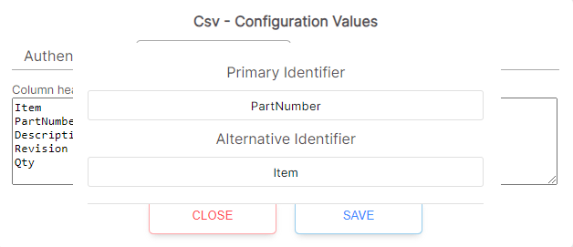

# CSV Setup

CSV (Comma Separated Values) files are utilized to import Bills of Materials (BOMs) from desktop-based CAD software such as Solidworks or Inventor into SharpSync. Follow the steps below to begin importing data into SharpSync using CSV files.

## Prerequisites
* Ensure your CSV output is complete.
* CSVs should contain BOM data only.
* Columns can be empty, but row data must not exceed the number of columns.
* BOMs should be exported in an indented or structured format to encapsulate an assembly's hierarchy.
* Flattened BOMs are not recommended.
* For best results, ensure that the CSV is in UTF-8 format.

## Instructions

1. On the Data Sources admin page, select "Csv" and click on the Add Datasource button.

2. Click the Configure button, then click on the BOM Configuration tab.
3. Enter the names of each column header. Make sure that the Column Headers you enter match your BOM output.

4. Click on Save to save your changes and close the window. (No Authentication is needed for CSV files)
5. Enter the Primary and Alternative Identifiers. Your Primary Identifier will populate the Component Hierarchy in the BOM view.

6. When you have finished, click on Update at the bottom to save.