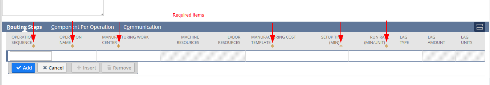
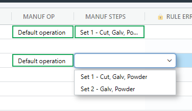

## Configure Routings

Routings in NetSuite, or in any manufacturing context, refers to a sequence of operations or steps that a product must go through during the manufacturing process. These steps can include various operations such as assembly, machining, laser and inspection.

<span style='color:orange'>Routing limitation (at time of writing): </span> For the NetSuite module, SharpSync only adds routings to BOMs that do NOT ALREADY have routings. This is to prevent overwriting existing manufacturing processes which may have been defined already. Please engage us for upgrading this functionality should you have need for it.

### Step 1: Manufacturing operation

To configure routings for Netsuite in Sharpsync, add at least 1 property mapping with the setting enabled: 
* `Is Manufacturing Operation` (let's call this `operationStep`)
* AND 1 more mapping
* `Is Manufacturing Step` (let's call this `manfacturingStep`)

For the property `operationStep` use the settings:

|Setting|Value|
|--|--|
|Primary source Property|(Unmapped)|
|Secondary source Property|(Unmapped)|
|Is Manufacturing Operation|<span style='color:orange'>Yes</span>|
|Is Manufacturing Step|<span style='color:SkyBlue'>No</span>|
|Rendering Type|Object List|
|List Display Selector|name|
|List Value Selector|value|
|List Items|See [List items for Operation Step](#list-items-for-operation-step) and [Finding the location IDs](#finding-the-location-ids) |

### List items for Operation Step
```json 
[{
    "name" : "Location - Inhouse",
    "value" : {
        "name": "SharpSync routing via rest",
        "subsidiary": { "id": 1 },
        "location": { "items": [ { "id": 5 }] }
    }
},
{
    "name" : "Location - External",
    "value" : {
        "name": "SharpSync routing via rest",
        "subsidiary": { "id": 1 },
        "location": { "items": [ { "id": 6 }] }
    }
}
]
```

### Finding the location IDs

To find your available location ids you can simply select Financial > Lists > Locations, and then grab the `INTERNAL ID`.

For the more technical users, use POSTMAN to authenticate, then

> <span style='color:orange'> /GET</span> https://[companyId].suitetalk.api.netsuite.com/services/rest/record/v1/location

and then followup with 

> <span style='color:orange'> /GET</span> https://[companyId].suitetalk.api.netsuite.com/services/rest/record/v1/location/{id}


### Step 2: Manufacturing operation steps

Operation steps are groupings of steps performed on an operation. Say you have a default set of steps for an assembly. Let's say it's to be powdercoated, cut, galvanized, then you'll want setup the steps accordingly (let's call this <span style='color:orange'>Set 1</span>):

You mileage may vary, but the default items required for setting up a routing are:
* Sequence,
* Name,
* WorkCenter
* CostTemplate
* SetupTime
* RunRate




This leads us to a json array body that looks something like the following:

```json
[
  {
    "operationsequence": 10,
    "operationName": "10 - Cutting",
    "manufacturingCostTemplate": { "id": 6 },
    "manufacturingWorkCenter": { "id": 48 },
    "setupTime": 5,
    "runRate": 1
  },
  {
    "operationName": "20 - Galvanize",
    "operationsequence": 20,
    "manufacturingCostTemplate": { "id": 6 },
    "manufacturingWorkCenter": { "id": 48 },
    "setupTime": 5,
    "runRate": 1
  },
  {
    "operationName": "30 - Powdercoat",
    "operationsequence": 30,
    "manufacturingCostTemplate": { "id": 6 },
    "manufacturingWorkCenter": { "id": 48 },
    "setupTime": 5,
    "runRate": 1,
    "lagType" : { "id" : "qtypercent"},
    "lagAmount" : 50
  }
]
```
However for a different type of assembly you might not require the cutting part as that is subcontracted out, so you have a different set of steps (Let's call this <span style='color:orange'>Set 2</span>):

```json
[ 
  {
    "operationName": "10 - Galvanize",
    "operationsequence": 10,
    "manufacturingCostTemplate": { "id": 6 },
    "manufacturingWorkCenter": { "id": 48 },
    "setupTime": 5,
    "runRate": 1
  },
  {
    "operationName": "20 - Powdercoat",
    "operationsequence": 20,
    "manufacturingCostTemplate": { "id": 6 },
    "manufacturingWorkCenter": { "id": 48 },
    "setupTime": 5,
    "runRate": 1
  }
]
```

You can group both of these "sets of steps" in an object list as follows:

```json
[
  {
    "name" : "Set 1 - Cut, Galv, Powder",
    "value" : [] // "{paste the values from set 1}",
  }
  {
    "name" : "Set 2 - Galv, Powder", 
    "value" : [] // "{paste the values from set 2}",
  }
]
```

You then add this list as a list of values for a property mapping as follows:

|Setting|Value|
|--|--|
|Primary source Property|(Unmapped)|
|Secondary source Property|(Unmapped)|
|Is Manufacturing Operation|<span style='color:SkyBlue'>No</span>|
|Is Manufacturing Step|<span style='color:orange'>Yes</span>|
|Rendering Type|Object List|
|List Display Selector|name|
|List Value Selector|value|
  

You can now save this mapping and load a bom to see the results in a BOM that was loaded.



Take note that there are some limitations imposed by Netsuite that must be followed. In the example shown above you cannot have lagTime at the middle of the list of steps, only at the end

.. [Back to Advanced BOMs](advanced_boms.md)