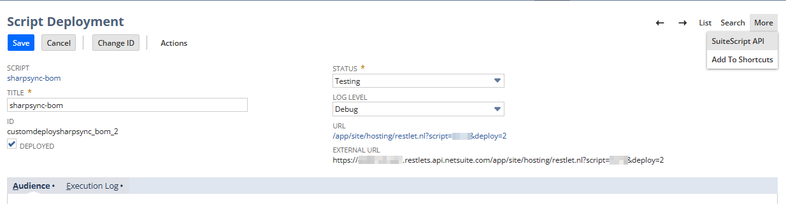

# Integration Tips

## Enable internal IDs

By enabling internal ids, you can hover over a field to see the internal ID it is linked to 

> https://docs.oracle.com/en/cloud/saas/netsuite/ns-online-help/section_N3423996.html#To-display-internal-ID-values%3A

This id is the accessor you will select in SharpSync

## Viewing the source of SuiteScript
You can view the source of the SuiteScript API by navigating to 

> Setup > Customization > Scripts > {your script} > View > More (top right) > SuiteScript API

This lists all the functions available to you when developing your scripts

