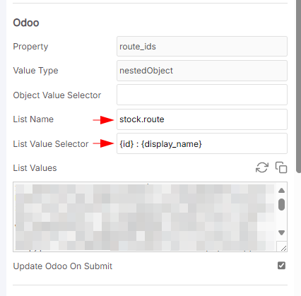
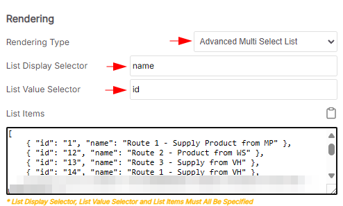
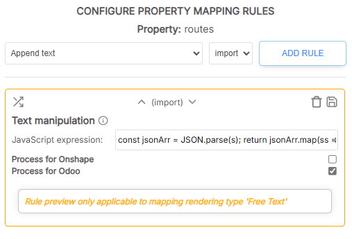

# Common List names
When setting up an Odoo source, it is useful to query the Odoo instance for lists of values for use in nestedObject property mappings.
This provides a way for you to keep the values that users can select in sync with those in Odoo.

> [!NOTE]
> For this to work the type in Odoo must be `nestedObject`. We don't currently support other types like `array` 

|List name|Returns|Sample data|
|----|----|----|
|product.category|Product template categories | `[ 1, "All" ], [ 9, "All / Consumable" ], `|
|product.tag|Tags assigned on the `General Information` tab | ` [ 11, "Kit" ], [ 12, "Assemble" ], [ 81, "Switches" ]`|
|stock.location|Locations you can assign for warehouses|`[ 14986, "MP" ], [ 14995, "MP/Assemble" ], [ 14990, "MP/Output" ],`|
|stock.route|Routes available for selection [2]|`[ 1, "Replenish on Order (ROO)" ], [ 2, "Receive in 1 step (RIS)" ]`|


## Stock Routes

Stock routes are represented as integer values in Odoo.
You can query stock routes with the following POSTman request

```json
{
  "id": 27,
  "jsonrpc": "2.0",
  "method": "call",
  "params": {
    "args": [ ],
    "model": "stock.route",
    "method": "name_search",
    "kwargs": {
      "context": {
        "lang": "en_US",
        "tz": false,
        "uid": 1,
        "allowed_company_ids": [ 1 ] // leave blank for all companies
      }
    }
  }
}
```

A typical list of values for this request returned from Odoo looks like this:

```json
{
    "jsonrpc": "2.0",
    "id": 27,
    "result": [
        [
            1,
            "Route 1 - Supply Product from MP"
        ],
        [
            2,
            "Route 1 - Product from WS"
        ],
        [
            3,
            "Route 1 - Supply from VH"
        ],
        //...etc
}
```
A typical cell value returned from Odoo looks like this:

> [1,5,7]

or 

> [7]

Not very user friendly, but we can fix that in the next step

### Step: Setting up the list on screen
Now that we know how to get the values, lets setup the list displayed onscreen. Lists like this can be cached in SharpSync, so the setup is done once and refreshed from time to time.



List name: `stock.route`
List Value Selector: `{id} : {display_name}`

Once this is done, click the `copy` button


So we need to convert the ids into a proper string to display onscreen. For that we'll use a `Text Manipulation` Rule to do the trick.



Make sure that the following `Text Manipulation` rule is applied for stock routes


* Rule Type: Text manipulation
* Applies to: Odoo
* Rule Value: 
```js
const jsonArr = JSON.parse(s); 
return jsonArr.map(ss => ss.toString());
```