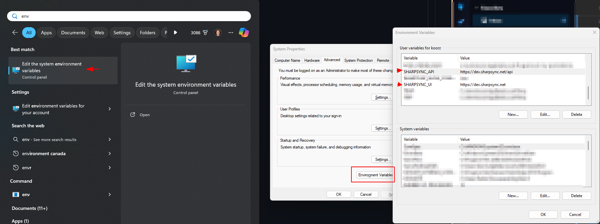
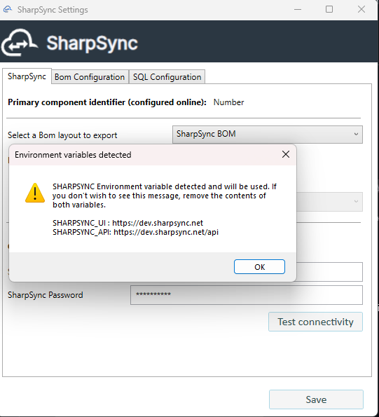

# Configure addin for testing

The SolidWorks PDM addin by default points to the production server which is located at https://app.sharpsync.net. 

While this is the default, it can be preferable to use the development server for testing purpose.

## Steps involved
* [Configure environment variables](#configure-environment-variables)
* [Configure the addin](#configure-the-addin)
* [Reverting environment variables](#reverting-environment-variables)

### Configure environment variables

To configure your environment variables
* Click Start > type `Environment` and select the option `Edit the system environment variables`
* Click `Environment Variables` at the bottom
* For the `User` variables, enter the following key value pairs by clicking `New`:
    * SHARPSYNC_API : https://dev.sharpsync.net/api
    * SHARPSYNC_UI : https://dev.sharpsync.net 

  

NOTE: Make sure to restart your machine or any processes so that the new values can take effect

### Configure the addin

After configuring the environment variables, its time to setup the addin inside the PDM administration tool

* Open the PDM adminstration tool > Login to the vault
* Navigate to the addin > Right click > Configure
* Select the Test connectivity button
* A warning is display that a different environment to that of production will be used

### Setup local user

After the addin has been configured, the same can be done for the user submitting the BOM to the SharpSync server.

* Navigate to the PDM view
* Right click the background > SharpSync > Configure SharpSync User ...

* Enter your SharpSync username and password > Click Ok

### Reverting environment variables

To revert your environment variables and work with the production instance
* Click Start > type `Environment` and select the option `Edit the system environment variables`
* Click `Environment Variables` at the bottom
* For the `User` variables, remove the following key value pairs by selecting them, and then clicking > Delete
    * SHARPSYNC_API 
    * SHARPSYNC_UI 

You are now ready to submit Bill of materials to the testing environment