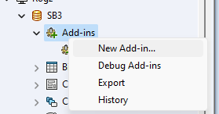
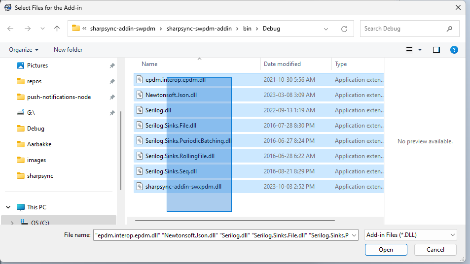
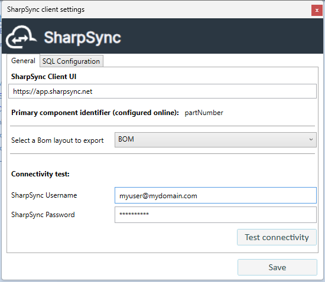
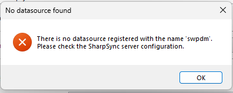
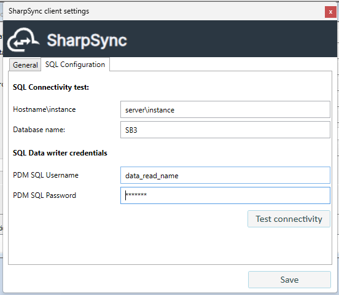
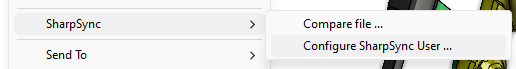
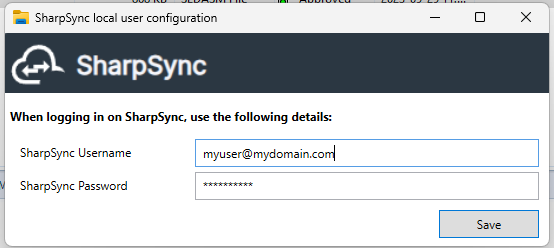

# SOLIDWORKS PDM Setup

The setup steps for SWPDM are as follows:
* Add the SWPDM datasource
* Make the PDM Web API available to the internet
* Test the connectivity to the server
* Download and install the PDM client
* Configure the PDM client for the vault
* Configure the PDM client for the logged in user

## Step: Add the SWPDM datasource

* Login on SharpSync
* Navigate to the Datasources section
* Select SWPDM 
* Click Add Datasource

## Step: Make the PDM Web API available to the internet
The PDM Web API must be accessible over the public internet. This is required for SharpSync to be able to connect to the PDM vault.

A domain name is not required. A public IP address is sufficient. However either of these must be accessible (Ping can be used) from the data source configuration page

Once the API is available, go back to the datasource configuration page and click `Ping` button. Upon success the following message will be displayed:
> Name   
> Connection status: Healthy  
> Connection message: `{serverName}` is accessible from the API

Where `{serverName}` is the name of the server that is hosting the PDM Web API

## Step: Test connectivity to the server

* In the datasource configuration section, select the PDM Datasource.
* After updating the server url, make sure to click the 'Update' button.
* Click the Ping button.
* If configured correctly, SharpSync will attempt to Ping the host.
* Important: Make sure that ICMP ping is enabled for this part. If it is not, please enable it (it can be disabled again)

## Step: Download and install the PDM Client

The PDM Client is only available for Windows machines. It is not available for Mac or Linux.

* Login on SharpSync
* Navigate to the Downloads section
* Download the PDM Client
* Extract all the files to a known location (e.g. Desktop)
* Open the administration tool and login on the vault
* Right click Addins > New Addin  
 
* Select the SharpSync addin from the extracted files. Make sure to select all the files  
  
   
* Click Open

## Step: Configure the PDM client for the vault

When configuring the addin for the vault, there are 2 sections to configure:
* The general setup which applies to all users
* The SQL setup which is used internally by the add-in

### General setup
This image shows a screen of the setup 

 

The following fields must be configured:
|Name|Description|Recommended value|
|--|--|--|
|Sharpsync Client UI|This is the url to which the user will be redirected once a BOM has been successfully submitted for comparison|https://app.sharpsync.net|
|BOM Layout|The BOM |BOM (or whatever layout you want to export to SharpSync)|
|SharpSync Admin credentials|User credentials that are used to setup the datasource|-|

Click `Test Connectivity`. Upon success, the configured primary identifier will be listed in the `Primary Identifier` field. This is the value that will be used to identify the file in SharpSync.

NOTE: If you get an error saying that no source is configured   

, 

First go to SharpSync > Datasources (you must be an admin) > Add the PDM datasource > This will create a source in SharpSync which will be used to store the data.

### SQL setup
The sql configuration page requires `data_reader` access for SQL Server. 

This image shows a screen of the setup 

## Step: Configure the PDM client for the logged in user

The general vault configuration applies to all users in the vault. However when uploading BOMs to SharpSync, the user must configure their own credentials to use SharpSync addin.

This is so that each BOM that is uploaded is associated with a user in SharpSync. This allows SharpSync to track who uploaded the BOM and who approved the BOM.

To configure the addin for the logged in user, follow these steps:
* Login to the vault
* Right click in the background or on any file > SharpSync > Configure SharpSync user...

Specify the user credentials that will be used to upload BOMs to SharpSync.  

