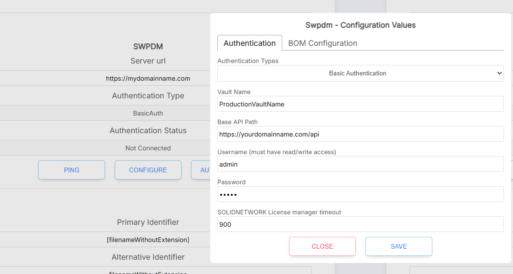
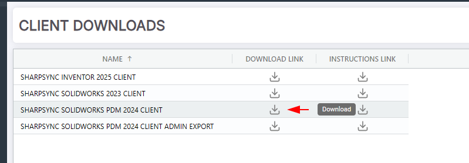

# SOLIDWORKS PDM Setup

The setup steps for SWPDM are as follows:
* Make the PDM Web API available to the internet
* Add the SWPDM datasource
* Test the connectivity to the server
* Download and install the PDM client
* Configure the PDM client for the vault
* Configure the PDM client for the logged in user

See also [Configure the addin for testing](configure_addin_for_testing.md)

## Step: Make the PDM Web API available to the internet

*The PDM Web API must be accessible over the public internet.* This is required for SharpSync to be able to connect to the PDM vault.

A domain name is not required. A public IP address is sufficient. However either of these (IP address or domain name) must be accessible from the internet.

(See [Test connectivity to server](#step-test-connectivity-to-the-server))

Once the API is available, go back to the datasource configuration page and click `Ping` button. Upon success the following message will be displayed:
> Name   
> Connection status: Healthy  
> Connection message: `{serverName}` is accessible from the API

Where `{serverName}` is the name of the server that is hosting the PDM Web API

## Step: Add the SWPDM datasource

* Login on SharpSync
* Navigate to the Datasources section
* Select SWPDM 
* Click Add Datasource

## Step: Test connectivity to the server

* In the datasource configuration section, select the PDM Datasource.
* After updating the server url, make sure to click the 'Update' button.
* Click the Ping button.
* If configured correctly, SharpSync will attempt to Ping the host.
* Important: Make sure that ICMP ping is enabled for this part. If it is not, please enable it (it can be disabled again)

## Step: Download and install the PDM Client

The PDM Client is only available for Windows machines. It is not available for Mac or Linux.

* Login on SharpSync
* Navigate to the Downloads section
* Download the PDM Client

* If you're having trouble installing the addin through the client, you can download the Admin Export (*.cex) file
* Extract all the files to a known location (e.g. Desktop)
* [Install using the downloadable instructions link or follow along here]
* Open the administration tool and login on the vault
* Right click Addins > New Addin  
 
* Select the SharpSync addin from the extracted files. Make sure to select all the files  
  
   
* Click Open

## Step: Configure the PDM client for the vault

When configuring the addin for the vault, there are 2 sections to configure:
* The general setup which applies to all users
* The SQL setup which is used internally by the add-in

### General setup
This image shows a landing screen of the setup.

 

The following fields must be configured:

|Name|Description|Recommended value|
|--|--|--|
|BOM Layout|The columns + values exported to SharpSync|BOM (or whatever layout you want to export to SharpSync)|
|SharpSync Admin credentials|User credentials that are used to setup the datasource|-|
|File name handling|How files will be named in the hierarchy. Can be either the name of the file or a variable (e.g. Number)|This is automatically configured in datasource configuration and cannot be changed in the add-in|

Click `Test Connectivity`. Upon success, the configured primary identifier will be listed in the `Primary Identifier` field. This is the value that will be used to identify the file in SharpSync.

NOTE: If you get an error saying that no source is configured   

, 

First go to SharpSync > Datasources (you must be an admin) > Add the PDM datasource > This will create a source in SharpSync which will be used to store the data.

### BOM Configuration setup
Setting up the BOM configuration allows you to customize how Bill of materials are uploaded to SharpSync.
|Section|Option|Description|
|---|---|--|
|Bom export|As Built|Export the version of the bom and its associated references as at the version selected||
|Bom export|Latest|Export the latest version of the bom and its associated references||
|Weldments|Export a weldmentpart as a part|Exports the weldment with the same qty referenced in the original BOM. Does not add children items from weldment members|
|Weldments|Export a weldmentpart as a part|Exports the weldment with the same qty referenced in the original BOM. *DOES* add children items|
|Sheetmetal|Export a weldmentpart as a part|Exports the weldment with the same qty referenced in the original BOM. Does not add children items from multibody parts|
|Sheetmetal|Export a weldmentpart as a part|Exports the weldment with the same qty referenced in the original BOM. *DOES* add children items|
|Excluded file types|Add file types on new lines|If a linked reference is found in the PDM BOM, it is not exported to SharpSync|

### SQL setup
The sql configuration page requires `data_reader` access for SQL Server. 

This image shows a screen of the setup 

Setting up the BOM configuration allows you to customize how Bill of materials are uploaded to SharpSync.
|Section|Option|Description|
|---|---|--|
|SQL Connectivity|Hostname\instance|Enter the name of the server and the sql instance. Use \MSSQL if the instance is not named|
|SQL Connectivity|Database name|Enter the name of the database. Typically the same as the vault name. Consult your IT Admin if you don't have access|
|SQL Credentials|PDM SQL Username|Name of a user which has the ability to create and execute stored procedures. This helps with the determination of weldment part types / sheetmetal part types|
|SQL Credentials|PDM SQL Password|Password of a user which has the ability to create and execute stored procedures. This helps with the determination of weldment part types / sheetmetal part types|

Note: The connection details are not stored in SharpSync online services. The credentials are stored in a vault dictionary called SharpSync using the PDM API. You can search for it using Vault > Tables > Dictionaries > SharpSync

 

## Step: Configure the PDM client for the logged in user

The general vault configuration applies to all users in the vault. However when uploading BOMs to SharpSync, the user must configure their own credentials to use SharpSync addin.

This is so that each BOM that is uploaded is associated with a user in SharpSync. This allows SharpSync to track who uploaded the BOM and who approved the BOM.

To configure the addin for the logged in user, follow these steps:
* Login to the vault
* Right click in the background or on any file > SharpSync > Configure SharpSync user...

Specify the user credentials that will be used to upload BOMs to SharpSync.  

