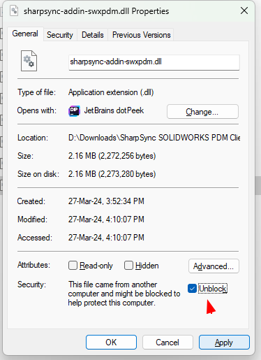

# SOLIDWORKS PDM  
Solidworks PDM is a data management solution from Dassault Systemes. It allows you to manage Solidworks files and their revisions, along with metadata like Vendor, Material, Description, etc.

## Prerequisites
* The PDM Profession version must be used
* The PDM Professional version API must be exposed to the internet using the Web API setup guide

## Installing the addin

### Extracting the files
When downloading the client from the `Downloads` section, a new zip file will be created on your machine.
Extract the files to a convenient location using `Right click > Extract all...`

### Preparing the files for installation

By default Windows will block all `.dll` and `.exe` files downloaded from an internet source. Because of this the addin will fail to install. You first need to unblock it. To unblock a file:

* `Right Click > Properties` 
* At the bottom of the first tab, There is a warninig
* Select the checkbox reading `Unblock`
* Click the apply button
* Repeat for all other files in the folder

Failing to do so may result in a message, 

> "The archive server could not open the Windows Registry",

when 'installing' a PDM addin. 

There are several things that can cause this error but these are the fixes that resolved this issue 100% of the time:

* Right click each dll, go to Properties, and check 'Unblock' in the lower right hand corner. This works most of the time (example above).
* If that doesn't work, export the addin from a working system as a .cex and install it on the end users system by importing it. Bear in mind that this may cause other issues though, so only use it as a last resort.
* It can also happen when the .net framework that the addin is written against does not exist on the machine where the addin is being installed
* It can also happen when the bitness of the addin is wrong (e.g. your compiling a 64bit addin but trying to run it on a 32bit machine)
 
### Next steps: See [setup](markdown/swxpdm-setup.md)
