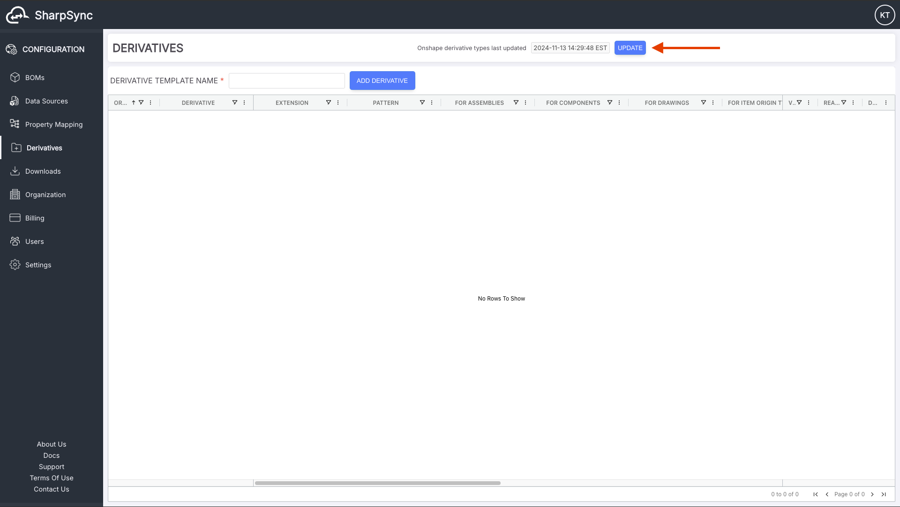
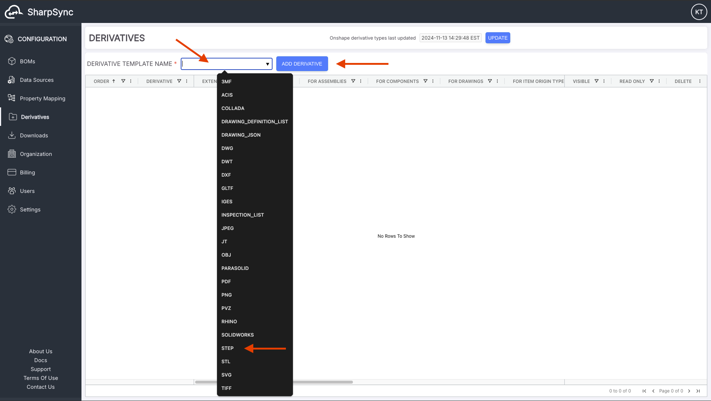
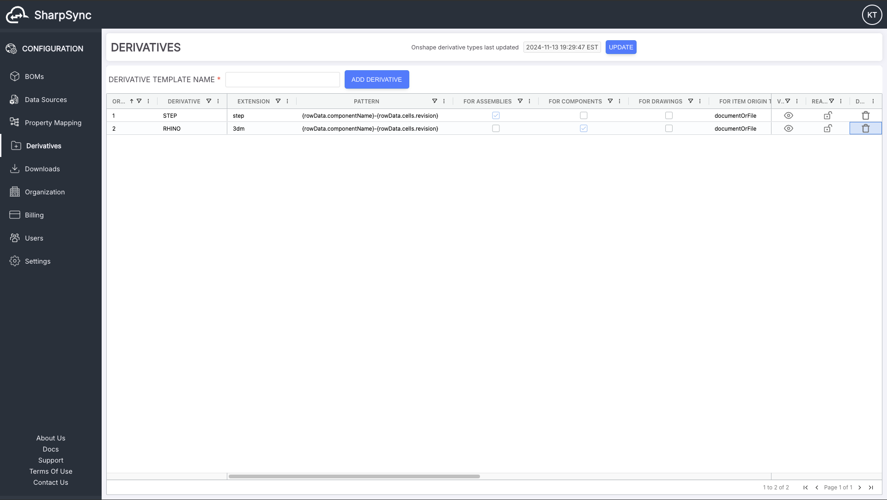
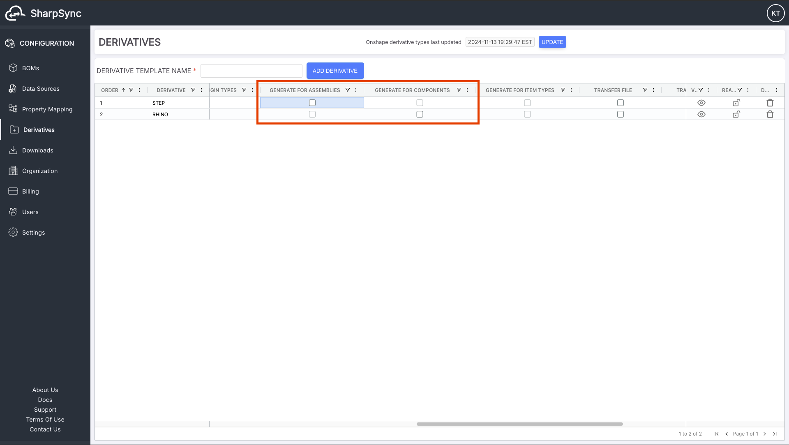
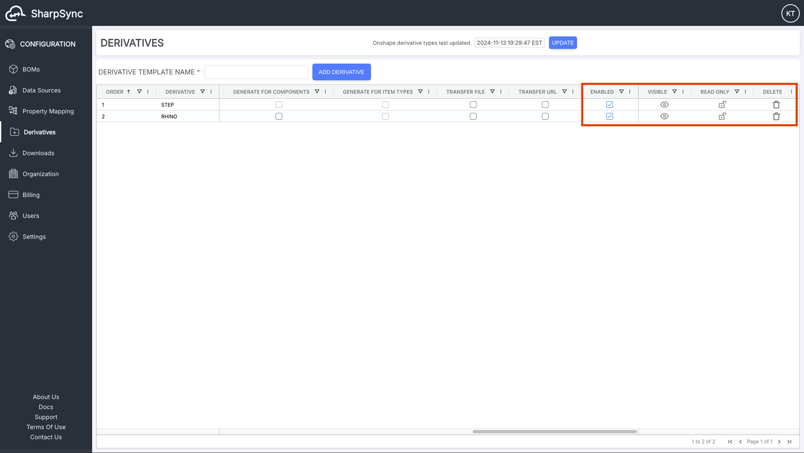
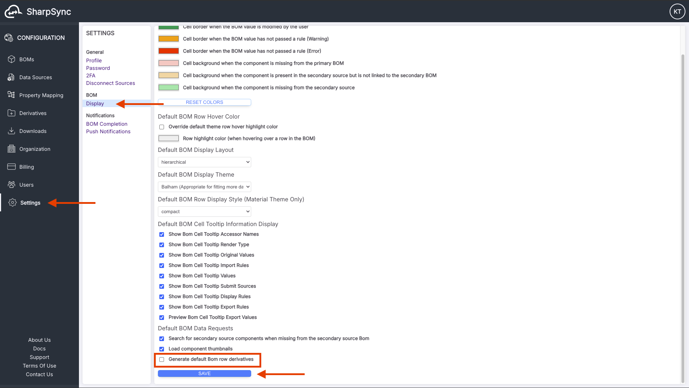
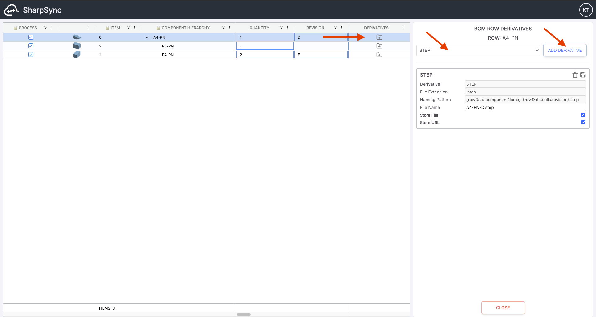
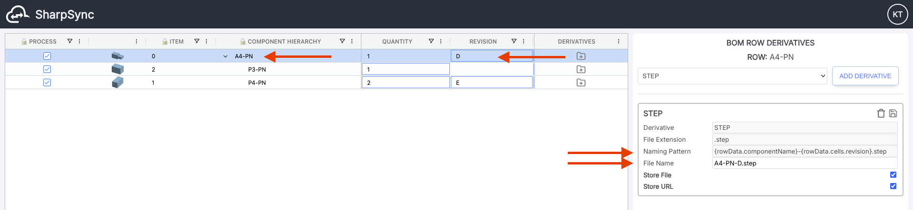
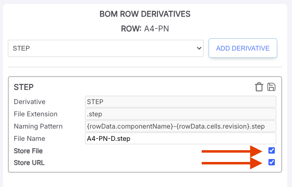

# Derivatives

Table of Contents

<blockquote>

[Adding Derivative Types](#adding-derivative-types)  
[Configure Derivative Types](#configure-derivative-types)  
[Auto Generate Default Derivatives](#auto-generate-default-derivatives)  
[Configure BOM Row Derivatives](#configure-bom-row-derivatives)  
</blockquote>

## Derivatives

### Overview

Derivatives are files or URLs that are derived from BOMs and Components in the CAD source, such as STEP, DWG, PDF, etc... files.
SharpSync's derivatives feature allows the manual or automated transfer of CAD BOM derivatives from the CAD Source to the ERP source.
The derivatives feature is currently only available for:
* CAD
  * Onshape
* ERP
  * Propel PLM

## Instructions

### Adding Derivative Types

1. First, make sure you have loaded all available derivatives from your source by clicking on the update source derivatives types button.

2. Second, click on the `DERIVATIVE TEMPLATE NAME` input to list the available derivative types to select from, then select a derivative type, andfinally click on the `ADD DERIVATIVE` button to add the derivative type.

3. After adding all the desired derivative types, you can now start to configure their settings

### Configure Derivative Types

1. You can double click on the `PATTERN` cell of each derivative type to change the file naming pattern of the derivative that will be transfered to your ERP source.

2. You can check/uncheck the `GENERATE FOR ASSEMBLIES` or the `GENERATE FOR COMPONENTS` checkbox of a derivative type to control which BOM row derivatives can be generated for which BOM component type (assemblies or components). For example, if the "STEP" derivative type is checked for assemblies, then the "STEP" BOM row derivative can be generated for any assembly row of your loaded BOM. (See also [Configure BOM Row Derivatives](#configure-bom-row-derivatives))

3. You can check/uncheck the `TRANSFER FILE` or the `TRANSFER URL` checkbox of a derivative type to have the corresponding BOM row derivative checkbox `Store File` or `Store Url` checked by default when the BOM row derivative is generated. (See also [Configure BOM Row Derivatives](#configure-bom-row-derivatives))

4. You can uncheck the `ENABLED` checkbox of a derivative type to prevent it from being available to be generated as a BOM row derivative. You can set a derivative type as `READ ONLY` to prevent the related generated BOM row derivatives from being configured on a per row basis. (See also [Configure BOM Row Derivatives](#configure-bom-row-derivatives))

### Auto Generate Default Derivatives

* In `Settings` -> `Display` , you can check/uncheck the `Generate default BOM row derivatives` in order to auto-generate the BOM row derivatives on SharpSync BOM load according to the derivative type configurations that you have set up in the previous section. (See also [Configure BOM Row Derivatives](#configure-bom-row-derivatives))

### Configure BOM Row Derivatives

1. If you have the user setting `Generate default BOM row derivatives` checked, all the BOM row derivatives should be auto-generated each time you load your BOM according to the derivative types configurations that you have set up in the previous sections.
2. Otherwise you can always manually add BOM row derivatives per row by:
   * Clicking on each BOM row's `DERIVATIVES` icon
   * Selecting the required derivative type from the selection list
   * Clicking on the `ADD DERIVATIVE` button
3. Note that the available derivative type list changes based on you configured derivative types.

4. You can further configure your generated BOM row derivative (if your derivative types settings permit it) on a per row basis. For example, you can manually change the `File Name` that will be stored in you ERP source. (Note: Some ERP sources such as Propel PLM have a pre-set logic on where to store component derivatives; other sources have a more flexible logic. SharpSync features that support other sources are currently in development)

5. You can also change the `Store File` or `Store Url` option on a per row basis.

### Derivatives Transfer

The CAD source derivatives will automatically be transferred to your ERP source as part of the SharpSync BOM Submittal process (when you click on the `SUBMIT BOM` button) according to your configured Derivative Types and BOM Row Derivatives settings.
   
