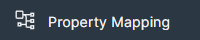
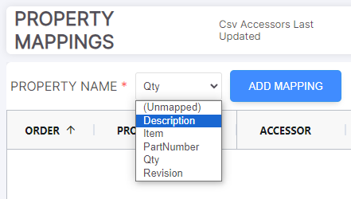
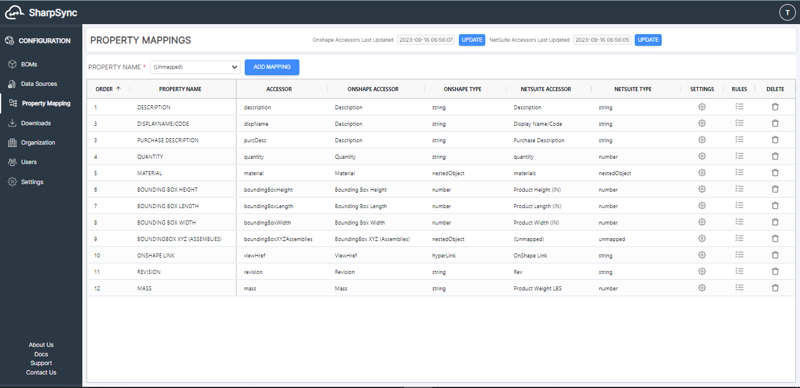
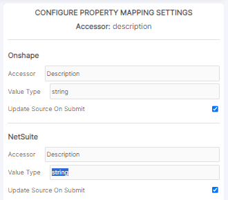
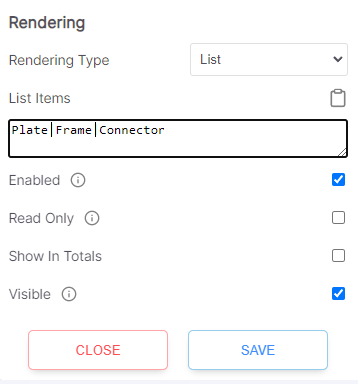
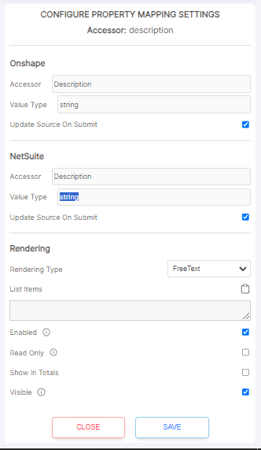
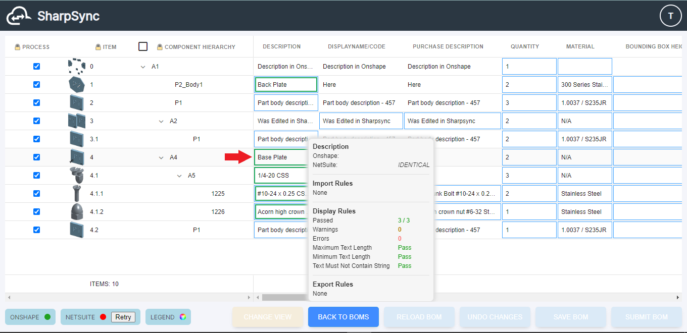

# Property Mapping
  
Property Mapping defines the way BOM data is displayed in SharpSync. Property Mappings can display a variety of CAD information including (but not limited to) BOM columns, Part or Assembly properties, Configurations, or CAD model data. SharpSync has built-in rules and settings for each property mapping. These rules and settings are used to help codify, standardize, and push changes to the selected datasources.

## Instructions
### Adding Property Mappings
1. On the Property Mapping page, select the Property you wish to map to the BOM.	
    * The column headers you entered in the Datasource BOM Configuration will populate each Property Mapping.
	* Each Property Mapping will be displayed as a column on the Component Assembly BOM page.

2. Once you have selected the property mappings that you want to appear in the SharpSync BOM, confirm that the Accessors, Primary Datasource Accessors, and Secondary Datasource Accessors columns are correct. You can double click on the cells in each column to change the value SharpSync will be matching. The accessor must be present in the appropriate datasource.

### Configure Property Mapping Settings
#### Update Datasource
1. To change the settings of each Property Mapping, click on the gear in the Settings column.
2. Verify that the accessor for each Datasource is correct. Click on the checkbox "Update Source on Submit" for each Datasource that you want to make changes to from SharpSync.
    * If you only want the information from the CAD data (Primary Datasource) to change the ERP/PDM/PLM (Secondary Datasource), then check only the Secondary Datasource checkbox.
    * If you want both sources to change, check both checkboxes.
    * Settings are saved for each Property Mapping.

#### Rendering
3. Rendering defines how the Property Mapping is viewed and accessed in the BOM.
    * Rendering Types change the display of the Property Mapping:
        * Checkbox - Toggle checkbox
        * FreeText - Enter text
        * List - Select from a list. Enter the list set in the textbox and separate each entry with a Vertical Pipe (see example below)
        * Url - Web address hyperlink
    * The remaining checkboxes affect the columns' display and interface:
        * Enabled - When unchecked the column will not be visible in the BOM nor any related mapping rule will be processed
        * Read Only - When checked, BOM column will not be editable
        * Show in Totals - The total for that column will be shown in the Totals row at the bottom of the BOM
        * Visible - When unchecked, column will not be visible, but user can unhide from the BOM column context menu
4. Click Save to finish.  

### Configure Property Mapping Rules
Property Mapping Rules are used to define the format for the BOM data. When a rule is applied, the cells for each column will be evaluated. If the cell data does not fall within the rules applied, the cell will display an error color on its border. Click on list icon in the Rules column for the Property Mapping desired to begin.  
#### Rule Setup

1. Select the rule desired. Be sure to select the type of rule that best matches the data type. (Text, Numeric, JavaScript expression, Json value)
2. Select display, import or export to determine when the rule is applied:
    * Display applies the rule in the SharpSync BOM.
    * Import applies the rule as data is being imported into the SharpSync BOM.
    * Export applies the rule as data is being exported from the SharpSync BOM.
3. Click on Add Rule to show the rule in the list.
4. This icon tells you what type of rule it is:
    * Data Validation - Evaluates validity of the cell data.
    * Data Transformation - Changes cell data to match the rule type.
5. This header shows the rule action, and the arrows allow you to move the rule up or down the list.
    * Rules are evaluated from top to bottom. If you want one rule to execute before another, ensure it is ordered correctly.
6. Saves any changes you make to the rule.
7. Deletes the rule from the list.
8. Rule name with :information_source: tooltip explanation at right.
9. Rule criteria
    * A textbox may be present to allow the user to define the rule parameter.
    * A description will be present if the parameter is not required.
10. On Rule Failure Action - Warning(s) will be present in the cell overlay when the rule fails.
    * Select pass to allow the user to still process the BOM.
    * Select block to require the user to fix the cell data before processing the BOM.
11. Depending on the rule selected, the bottom line may display options for processing the rule. Select the Datasources that will be updated.
12. Closes and saves the Rules module. Rules in the list will be saved and applied to the BOM.

<figcaption style="text-align:center">

Cell overlay for part A4 - Base Plate (Red Arrow)

</figcaption>