# Property Mapping Rules

Rules for property mappings fall into 1 of 3 categories:

* Import Rules (Data transformation)
* Display Rules (Data validation)
* Export Rules (Data transformation)

## Main concepts for Rules


* Each type of rule can be reordered within it's own category, but you cannot move an export rule before an import rule
* Import rules work on the raw source data and are applied to each individual data source's data.
* Javascript rules have access to 3 parameters, not just 1.
  
### Each type of rule can be reordered within it's own category, but you cannot move an export rule before an import rule
The order that rules run in always follow the following order:
* import
* display
* export

 You can reorder the rules, but export rules cannot appear before import rules. Import/Export rules have an orange border, while display rules only have a gray border.

### Import rules work on the raw source data and are applied to each individual data source's data.
 Each rule runs only on the source that it is being applied on 

In the example below, the `Format as decimal` rule runs for both NetSuite and Onshape. The rules individually runs on the individual strings of data imported. The rule running for NetSuite is not aware of the data being imported for Onshape. That means that when running a rule such as a javascript `Text Manipulation` rule, the rule runs only for one source at a time, never for both at the same time. 


Pro tip: One way to get around this is to create an `Text evaluation` rule to match the value of a cell to that of another and return a display message to the user. Or use a `Text manipulation` rule to write a message to a cell value and give the user a message onscreen.

Considering that we have Datasource 1 (DS1) and Datasource 2 (DS2), the process would be:

* Setup the initial (let's call it the 1st) property column. Give it an accessor of `description` with a column mapping of property `description` for DS1 and for DS2
* For now let's say. The value comes from DS1. Let's say the value is `Coil`.
* Setup a 2nd `description` column. Call it `Description2` - value of `s` is the same by default.
* Add a  `Text evaluation` display rule to the 2nd column.
* Enable the setting on the 2nd column: `Prefer {DS2} Value`. This forces the value from DS2 to display instead of the value of DS1 displaying by default
* Add a `Text evaluation` rule. This rule only has access to `s` - the current string value. which has the following logic:
* If the value of `s` == `rowData.cells.description`, return a message to the user. Written out in Javascript it would look like this

 ```javascript
if (s === rowData.cells.description) 
  return { status: 'failure', message: `The values must not be the same` };

```

Note that returning any value in the `message` above can be customized by you.

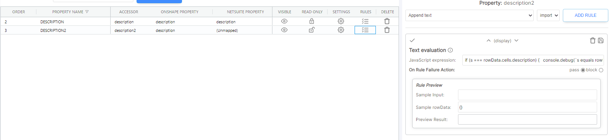

The data from DS2 is imported after that of DS1. The rules start running for DS2

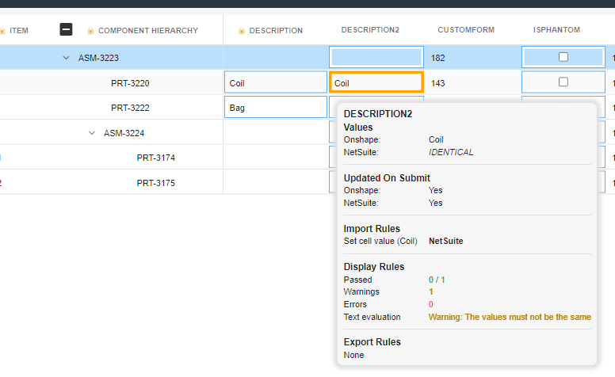


### Javascript rules have access to 3 parameters, not just 1:

Typical rules only have access to the string value `s` which is passed to it. The `Text manipulation` rule has access to more data which allows for much greater scripting capability. The result of a text manipulation rule must always be a `string` or a representation of a `string` such as a javascript `object` which has been serialized. If it does not return a value you may experience unexpected results in the UI, possibly even instability in attempting to render client side BOMs.

  | Param | Description |
  | -- | -- |  
  |s|The current string value in the cell (changes with each successive import rule (if there are any) |
  |rowData|The rowData object (more detail below **)|
  |p|The pass / block value|

** The rowData value is a special value. It contains, but is not limited to, the following key/values:
<table>
 <th>   Key name  </th>
 <th>   Description of the value </th>
  <tr>
  <td>isAssemblyRow</td>
  <td> A bool value indicating if the current row value is an assembly row (contains children according to the source) </td>
 </tr>
 <tr>
  <td>componentName</td>
  <td>The primary identifier of each row - typically the name of the component</td>
 </tr>
 <tr>
  <td>componentPathArray</td>
  <td>The path of each component. So if you have assembly A1, with Part P1, then this value will be [ 'A1', 'P1' ] </td>
 </tr>
 <tr>
  <td>cells</td>
  <td>The row values for the entire row. A typical row object might look something like this (notice the nested `cells` key):
   
   ```json 
   {
     "isAssemblyRow" : false,
     "componentName" : "Part 1",
     "componentPathArray" : [ "A1", "Part 1"],
     "cells" : {
        "partNumber" : "P1",
        "description" : "Side plate",
        "revision" : "A"
        "material" : "steel",
        "qty" : 1,
     }
   } 
```
   
  </td>
 </tr>

</table>

  
## Import rules
Import rules are run when the data is imported from the source. The rule will change the incoming value from the datasource. For example, if you have value from a CSV file that is being imported as 0, you can transform the value using the `Text Manipulation` rule to change from `0` => `0.0`

*Example*
You have a value that is received from the datasource as a json object, say 
```json
 {
   "id" : 42,
   "refName" : "Material Name"
 }
```

You can use the

> `Select from Json`

rule to select the key called `refName` from this Json object. The value displayed onscreen will be `Material Name`

*Example*
```json
[
{
   "id" : 41,
   "refName" : "Material Name 1"
},
{
   "id" : 42,
   "refName" : "Material Name 2"
 }
]
```
You can use the 

> `Select from Json`

rule to select the key called `[1].refName` from this Json object. The value displayed onscreen will be `Material Name 2`. The selector `[1].refName` uses a text string to select the value from the array of values. In this case select from the 2nd element (indexes start at 0, so select element 1, which is the 2nd element in the array of 2 elements), then select the `refName` key on the element. Nested properties are supported.


## Display Rules

Display rules are rules that trigger either warnings or errors _after_ the data has been imported. This plays out as: 
* Data is imported
* Import rules are applied to transform data
* Data is displayed onscreen
* Rules are evaluated
* Warnings or errors are displayed based on the rule conditions

A Display Rule can be set to either `pass` or `block`.
* A value of `pass` will show a orange border if it fails. The user is still able to submit the BOM
* A value of `block` will show a red border if it fails. The user is not able to submit the BOM
* (Colors are configurable)

## Export rules
Export rules are run when the data is exported from SharpSync when using the `Submit BOM` button. The rule will change the value sent to the datasource. For example, if you have value from a source, say Onshape, that was imported as `0`, the displayed onscreen as `0.0`, you can transform the value using the `Text Manipulation` rule to change from `0.0` => `0` so that the value may be accepted by Onshape.

  
## List of preset rules
Below is a comprehensive list of seach Property Mapping Rule. Expand the Table of Contents and click a specific rule to jump to that rule. Learn more about Rule setup: [Configure Rules](/propertymapping/markdown/propertymapping.md#configure-rules)  

<details open>
    <summary>Table of Contents</summary>
    <blockquote>
    <details>
        <summary>Display Rules</summary>
        <blockquote>

[Cell value evaluation](#cell-value-evaluation)  
[Maximum text length](#maximum-text-length)  
[Minimum text length](#minimum-text-length)  
[Number between](#number-between)  
[Text length must be between](#text-length-must-be-between)
</blockquote>
</details>
<details>
    <summary>Import/Export Rules</summary>
    <blockquote>

[Append text](#append-text)  
[Calculate number](#calculate-number)  
[Format as decimal number](#format-as-decimal-number)  
[Select from JSON](#select-from-json)  
[Prepend text](#prepend-text)  
[Replace text](#replace-text)  
[Round to nearest X](#round-to-nearest-x)  
[Set cell value](#set-cell-value)  
[Set empty cells](#set-empty-cells)  
[Text length must equal](#text-length-must-equal)  
[Text manipulation](#cell-value-manipulation)  
[Text must be exactly](#text-must-be-exactly)  
[Text must contain string](#text-must-contain-string)  
[Text must end with string](#text-must-end-with-string)  
[Text must not be empty](#text-must-not-be-empty)  
[Text must not contain string](#text-must-not-contain-string)  
[Text must not end with string](#text-must-not-end-with-string)  
[Text must start with string](#text-must-start-with-string)  
[Value must be in list](#value-must-be-in-list)  
[Value must not be in list](#value-must-not-be-in-list)  
[Value must be a number](#value-must-be-a-number)  
[Values must not be a number](#values-must-not-be-a-number)  
        </blockquote>
    </details>
[Interpreting the Results](#interpreting-the-results)
    </blockquote>
</details>

### Display Rules
#### Text evaluation
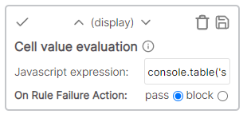  
Evaluates the cell value given the javascript expression. Available parameters:  
* s (display value)
* rowData (the record containing the accessors data and additional metadata)

Notes on `rowdata`:
rowData is a object which contains the following noteworthy child items:
* rowData.cells (each cell value without modification. This can include the altered values as set in import rules)
* rowData.modifications (any modifications made by the user as at the time the rule is run)

Special notes:

Whenever you create a text evaluation rule that evaluates the value of _another cell_, you must take into consideration the modifications of the other cell. 

e.g. if the accessor you're evaluating for is `myProperty1` and the condition is based on the value of accessor `myProperty2`, first check in your rule for the existance of `rowData.modifications.myProperty2`. If it exists, then use it, otherwise use `rowData.cells.myProperty2`. Example below

```javascript
// if the key exists in the object return its value, otherwise, return the value in the rowData.cells
const myValue2 = "myProperty2" in rowData.modifications ? rowData.modifications.myProperty2 : rowData.cells.myProperty2;

// now do something with the value you got above
if ({conditionBasedOnMyValue2})
  return { message: `the message you want to return` };
```

 
[Return to Top](#list-of-property-mapping-rules)  

#### Maximum text length
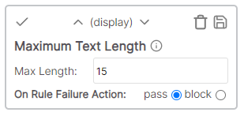  
Limits the length of the cell value text to a number of characters.  
<details>
    <summary>Example</summary>  
    
* Cell value: Description
* Rule value: 4
* Result: Fail - number of characters > rule.  
</details>

[Return to Top](#list-of-property-mapping-rules)  

#### Minimum text length
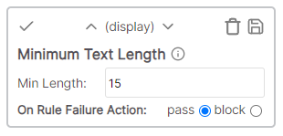  
The number of characters in the cell value must be greater than the specified number.  
<details>
    <summary>Example</summary>  
    
* Cell value: Description
* Rule value: 4
* Result: Pass - number of characters > rule.  
</details>

[Return to Top](#list-of-property-mapping-rules)  

#### Number between
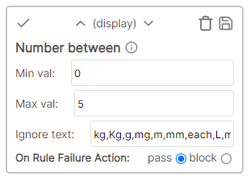  
Converts cell value to a number and evaluates if number is within a range of values, and ignores text listed in textbox.  
<details>
    <summary>Example</summary>  
     
* Cell value: 12.5 kg
* Rule values:
    * Min val: 1
    * Max val: 100
    * Ignore text: kg,Kg,g,mg,m,mm,each,L,ml,oz,fl
* Result: Pass - "kg" ignored, cell value between min\max.  
</details>

[Return to Top](#list-of-property-mapping-rules)  

#### Text length must be between
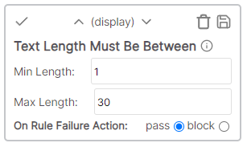  
The number of characters in the cell value must be between the lower and upper limit.  
<details>
    <summary>Example</summary>  
    
* Cell value: Part
* Rule values:
    * Min length: 5
    * Max length: 15
* Result: Fail - number of characters outside of min/max range.  
</details>

[Return to Top](#list-of-property-mapping-rules)  

### Import/Export Rules
#### Append text
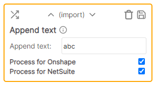  
Adds the specified text to the end of the cell value.  
<details>
    <summary>Example</summary>  
     
* Cell value: this
* Rule value: -item (applied to all cells in column)
* Result: this-item  
</details>

[Return to Top](#list-of-property-mapping-rules)  

#### Calculate Number
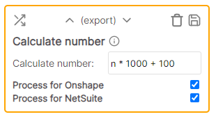  
Uses the cell value and performs a calculation. The result of the calculation replaces the cell value.  
<details>
    <summary>Example</summary>  
    
* Cell value: .07
* Rule value: n * 100
* Result: 7 (.07 * 100)
</details>

[Return to Top](#list-of-property-mapping-rules)  

#### Cell value manipulation
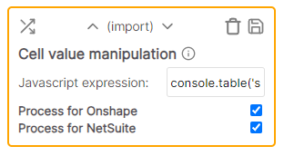  
Manipulates (and returns the result of) the cell value given the javascript expression. Available parameters:  
* s (original value)
* rowData (the existing row containing rowData.cells which is the accessors)  

[Return to Top](#list-of-property-mapping-rules)  

#### Format as decimal number
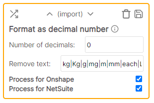  
Converts the cell value to a number and adds the specified number of decimals. This formats the number as it is viewed and does not round it. Any text specified to be removed will be replaced/ignored during the number format.  
<details>
    <summary>Example</summary>  
     
* Cell value: 12.53 m
* Rule values:
    * Number of decimals: 4
    * Remove text: kg|Kg|g|mg|m|mm|each|L|ml|oz|fl
* Result: 12.5300
</details>

[Return to Top](#list-of-property-mapping-rules)  

#### Select from JSON
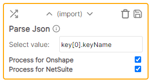  
Converts the cell value from text to a JSON object and returns the value given by the specified key. Supports nested key/values and arrays. You can use key.value[2].key to retrieve value for a given key.  

[Return to Top](#list-of-property-mapping-rules)  

#### Prepend text
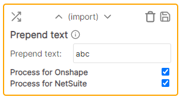  
Adds the specified text to the beginning of the cell value.  
<details>
    <summary>Example</summary>  
    
* Cell value: 123
* Rule value: ABC-
* Result: ABC-123
</details>

[Return to Top](#list-of-property-mapping-rules)  

#### Replace text
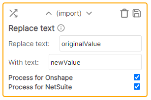  
Replaces any instances of the specified text with the new value.  
<details>
    <summary>Example</summary>  
    
* Cell value: Hello, world
* Rule values:
    * Replace text: world
    * With text: there
* Result: Hello, there
</details>

[Return to Top](#list-of-property-mapping-rules)  

#### Round to nearest X
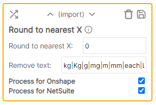  
Rounds the number to the nearest specified number. Supports integers only. (Positive or negative whole number.)  
<details>
    <summary>Example</summary>  
    
* Cell value: 1234.5678 mm
* Rule values:
    * Round to nearest X: 10
    * Ignore text: kg|Kg|g|mg|m|mm|each|L|ml|oz|fl
* Result: 1230
</details>

[Return to Top](#list-of-property-mapping-rules)  

#### Set cell value
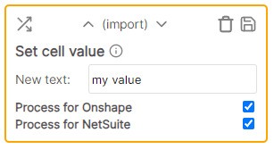  
Sets the cell value to the specified text.  
<details>
    <summary>Example</summary>  
    
* Cell value: Hello, world
* Rule value: Description
* Result: Description
</details>

[Return to Top](#list-of-property-mapping-rules)  

#### Set empty cells
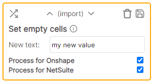  
Set an empty (any cell that has whitespace or no value) cell value to the specified text.  
<details>
    <summary>Example</summary>  
    
* Cell value is empty 
* Rule value: Description
* Result: Description  
</details>

[Return to Top](#list-of-property-mapping-rules)  

#### Text length must equal
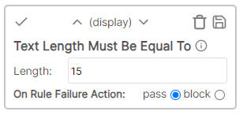  
The number of characters in the cell value must be exactly the length specified.  
<details>
    <summary>Example</summary>  
    
* Cell value: Description
* Rule value: 12
* Result: Fail - Description is only 11 characters
</details>

[Return to Top](#list-of-property-mapping-rules)  

#### Text must be exactly
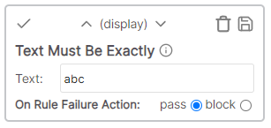  
The cell value must be an exact match with the specified text.  
<details>
    <summary>Example</summary>  
    
* Cell value: Description
* Rule value: Description1
* Result: Fail - Description1 does not match Description
</details>

[Return to Top](#list-of-property-mapping-rules)  

#### Text must contain string
  
The cell value must contain the specified text.  
<details>
    <summary>Example</summary>  
    
* Cell value: Final Description
* Rule value: Final
* Result: Pass - Cell value contains text "Final"
</details>

[Return to Top](#list-of-property-mapping-rules)  

#### Text must end with string
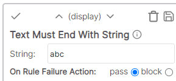  
The cell value must end with the specified string.  
<details>
    <summary>Example</summary>  
    
* Cell value: Description
* Rule value: abc
* Result: Fail - Cell value does not have suffix of abc
</details>

[Return to Top](#list-of-property-mapping-rules)  

#### Text must not be empty
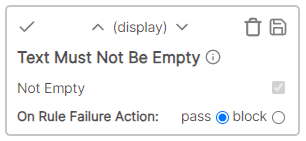  
The cell value must not be empty.  
<details>
    <summary>Example</summary>  
    
* Cell value: Description
* Result: Pass - Cell value is not empty
</details>

[Return to Top](#list-of-property-mapping-rules)  

#### Text must not contain string
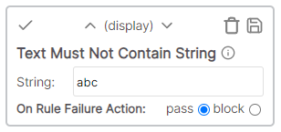  
The cell value must not contain the specified string.  
<details>
    <summary>Example</summary>  
    
* Cell value: Description
* Rule value: rip
* Result: Fail - Cell value "Description" contains "rip"
</details>

[Return to Top](#list-of-property-mapping-rules)  

#### Text must not end with string
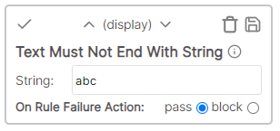  
The cell value must not end with the specified string.  
<details>
    <summary>Example</summary>  
    
* Cell value: Description
* Rule value: ion
* Result: Fail - Cell value "Description" ends with "ion"
</details>

[Return to Top](#list-of-property-mapping-rules)  

#### Text must start with string
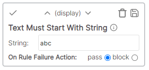  
The cell value must start with the specified string.  
<details>
    <summary>Example</summary>  
    
* Cell value: Description
* Rule value: Desc
* Result: Pass - Cell value "Description" begins with "Desc"
</details>

[Return to Top](#list-of-property-mapping-rules)  

#### Value must be in list
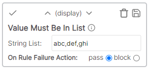  
The cell value must match a value in a string list. Entries are separated by a comma.    
<details>
    <summary>Example</summary>  
    
* Cell value: Desc
* Rule value: abc,def,ghi
* Result: Fail - Cell value "Desc" does not match any list value
</details>

[Return to Top](#list-of-property-mapping-rules)  

#### Value must not be in list
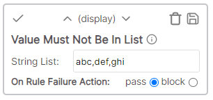  
The cell value must not match a value in a string list. Entries are separated by a comma.    
<details>
    <summary>Example</summary>  
    
* Cell value: Desc
* Rule value: abc,def,ghi
* Result: Pass - Cell value "Desc" does not match any list value
</details>

[Return to Top](#list-of-property-mapping-rules)

#### Value must be a number
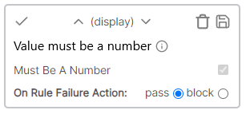  
The cell value must be a number.  
<details>
    <summary>Example</summary>  
    
* Cell value: 12.5a
* Result: Fail - Cell value contains non-numeric character "a"
</details>

[Return to Top](#list-of-property-mapping-rules)  

#### Value must not be a number
  
The cell value must not be a number.
<details>
    <summary>Example</summary>  
    
* Cell value: 12.5a
* Result: Pass - Cell value contains non-numeric character "a"
</details>

[Return to Top](#list-of-property-mapping-rules)

### Interpreting the Results

SharpSync processes and prioritizes each rule in order from top to bottom. Moving a rule up or down the list can change the result depending on the subsequent outcome. See the examples below to gain an idea of how results are evaluated:

#### Example 1: Text-based Rule Application  
##### Preconditions
* Property Mapping: Description (Text)  
* Sample Cell Data: "Connector Bracket 1_REL"

##### Rules
1. Prepend Text: "ABC-"
2. Text Must End with String: "_REL"
3. Maximum Text Length: 25

##### Evaluation
1. PASS: Text is appended to be "ABC-Connector Bracket 1_REL"
2. PASS: Text does end with the string "_REL"
3. FAIL: Text length is longer than maximum. Text was originally 23 characters; the prepended text makes the character length 27.

* Quick Fix: change the text in SharpSync by removing charcaters or abbreviating words. Datasources can be updated when the BOM is submitted with the changes, depending on the Property Mapping settings.
* If the Maximum Text Length was ordered before the Prepend Text rule, all rules would evaulate as passing.

#### Example 2: Numeric Rule Application
##### Preconditions
* Property Mapping: Weight (Numeric value)
* Sample Cell Data: "123.54 kg"

##### Rules
1. Replace Text (removing spaces)
    * Orginal Value: " "
    * New Value: ""
2. Format as Decimal Number  
    * Number of Decimals: 0
    * Remove Text: kg|KG|g|lb|lbs
3. Round to Nearest X: 1
4. Number Between
    * Min Value: 1
    * Max Value: 123

##### Evaluation
1. PASS: Space is removed, new text is "123.54kg"
2. PASS: Text is changed to Decimal. Any characters after tenth place is dropped. New value is 123.
3. PASS: Decimal is rounded to the nearest whole number of 123.
4. PASS: Number is between or equal to the minimum and maximum values of 1 and 123.

* If the 2nd and 3rd rules were reversed, the last rule would fail. The number would be rounded first, which would result in the new number being 124, which is larger than the last rule's maximum value.
